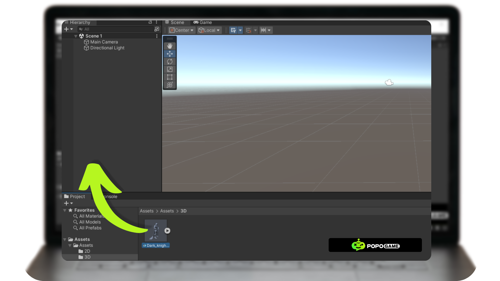

# How to upload 2D or 3D Objects in Unity Considering the Performance Factor of the Game to be Created 

In game development, it is very important to create various assets, be it textures, 2D objects, 3D objects, or audio. These assets play a crucial role in building an exciting and interactive gaming world. Once the assets are created, the next step is to add 2D and 3D objects to the previously created project. This process involves setting the position, scale, and rotation of objects, as well as ensuring that all elements work together in harmony to create a fun and immersive gaming experience. As such, game development is not only about creating assets but also about how to integrate and optimize those assets in the overall game project.

In this tutorial, we will make a simple staging to support the creation of an environment. The final result of this tutorial will be as shown in the image below.

## Things to consider before importing assets into a project

At the stage of preparing for the import of assets, it is important to evaluate the technical specifications of each asset. Factors such as the number of polygons, texture, and file size will have a direct impact on the game's performance. By choosing the right assets and optimizing them appropriately, we can ensure that the game runs smoothly without sacrificing visual quality.

**Asset Specifications that need to be considered are:**
**1. Number of vertex:** The number of vertices on a 3D object greatly affects the performance of the game. The more vertex, the more complex the object is, and the heavier the load that the device has to process. Therefore, it is important to pay attention to the number of vertices when creating a 3D model for a game.
**2. Texture Resolution:** Choosing the right texture resolution is essential for maintaining a balance between visual quality and game performance. High-resolution textures do provide a better look, but they can slow down the game and increase the file size.
**3. Draw Calls:** Draw calls are commands for the GPU to draw objects in the game. The more different objects or materials, the more commands must be given, thus slowing down the game. To improve performance, we need to reduce the number of these commands by merging similar objects.
**4. Rigging and Animation:** Rigging and animation are like giving skeletons and movements to characters in the game. The more complex the framework and movement, the heavier the load on the computer. This can make the game slow or even crash. The solution: Simplify the framework and movements, or use special techniques like baking to keep the game flowing.

## Prepare the assets to be included in the project and set up the folders for the project.

Before you put assets into your project, you need to check all the objects that you will put into your game project. Here are some things that need to be considered:

**1. Origin:** Origin is the central point of the 3D object, you need to check it so that when it has been uploaded to the project you can make it easier to change the position, rotation and scale of the 3D object that you input.
**2. File Naming:** In creating a project, it is very important to organize the files that you upload into the project file so that it is easier to find when you need it again in the future.
**3. File Organizer:** Organizing files in Project files is also very important because it will make it easier for you to see similar files in your project.

## Import Assets into the project 

1. After all the assets have been prepared, then you import the assets that you have created into the Unity Project File, you can drag and drop your asset files into the respective folders that you have prepared.

2. Next, we need to create a material to accommodate the texture file that you have created by right-clicking on the project file -> Create -> Material, this is intended so that the texture file can be implemented into an object that has previously been applied to a texture.

3. Insert your JPG or PNG file into the material that has been created, by selecting the material that has been created first then to the inspector section and clicking the dot next to the word albedo, then select the image you want to texture as in the image below.

4. Next, drag and drop the 3D characters in the Project File into the scene hierarchy.

5. Drag and drop material that contains a texture that fits the body of the character who is already in the scene.

6. Insert your JPG or PNG file into the material that has been created, by selecting the material that has been created first then to the inspector section and clicking the dot next to the word albedo, then select the image you want to texture as in the image below.

Then the texture will be applied to the character with the material intermediary. If all has been done, don't forget to save periodically File -> Save Project or Ctrl + S.
